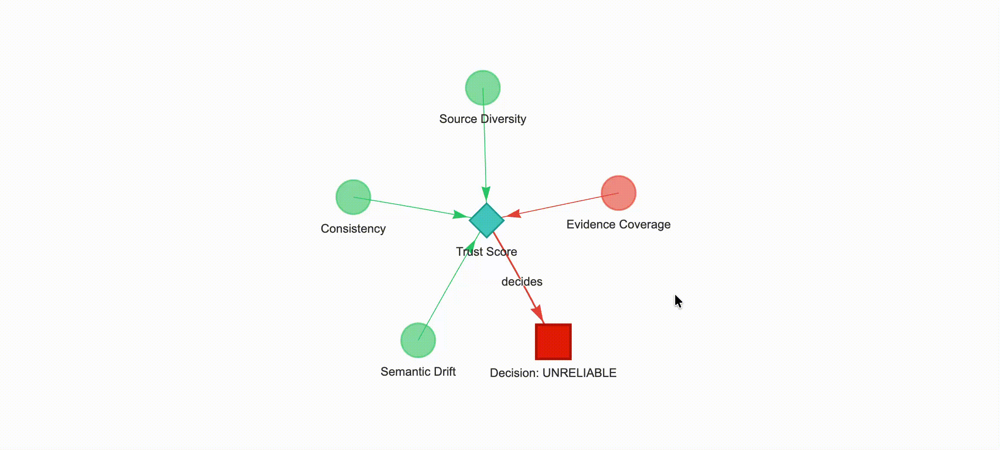
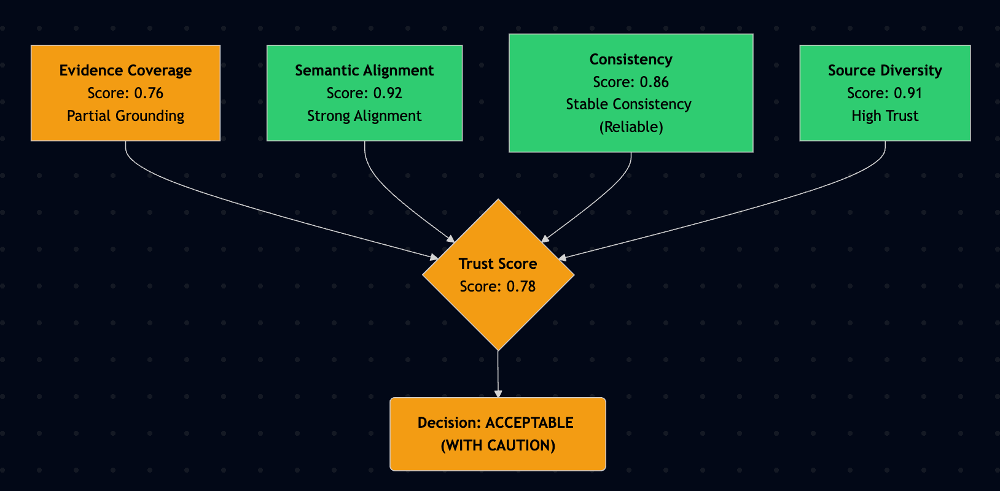

# Trustifai 
**🛡️Quantify, Visualize, and Explain Trust in RAG Applications.**

Trustifai is a Python-based observability engine designed to evaluate the trustworthiness of Retrieval-Augmented Generation (RAG) systems. Unlike simple evaluation frameworks that rely on a single "correctness" score, Trustifai computes a multi-dimensional **Trust Score** based on grounding, consistency, alignment, and diversity.


It includes an interactive **Reasoning Graph** generator to help debug why a model output was deemed unreliable.


## 📊 Key Metrics

**Trustifai** evaluates trustworthiness using four orthogonal vectors. The final *Trust Score* is a weighted aggregation of these components.

### Offline Metrics

| Metric | Definition | Purpose |
|------|------------|---------|
| Evidence Coverage | Segment-level entailment check. The answer is tokenized into sentences and each sentence is verified against retrieved documents using an NLI (Natural Language Inference) approach via an LLM or reranker. | Detects hallucinations. Ensures every claim is supported by the provided context. |
| Epistemic Consistency | Measures semantic stability ($1 - \sigma$) across $k$ stochastic generations. Samples $k$ responses at high temperature and computes the mean cosine similarity against the original answer. | Detects model uncertainty. Hallucinated answers tend to vary significantly between runs. |
| Semantic Alignment | Cosine similarity between the Answer Embedding vector ($V_A$) and the Mean Document Embedding vector ($\mu_{D}$). | Detects topic drift. Ensures the answer stays within the semantic envelope of the context. |
| Source Diversity | Normalized count of unique `source_id` references used to derive the answer, penalized by an exponential decay function. | Detects single-source bias. Rewards synthesis from multiple independent sources. |

### Online Metrics

| Metric | Definition | Purpose |
|------|------------|---------|
| Confidence Score | Calculated using the log probabilities (logprobs) of the generated tokens. It considers the geometric mean of probabilities penalized by the variance of the generation. | Provides a real-time confidence signal (0.0−1.0) indicating how sure the model is about its own output.
 
## 🚀 Installation

Trustifai requires Python 3.9+.

```
# Clone the repository
git clone [https://github.com/your-org/trustifai.git](https://github.com/your-org/trustifai.git)
cd trustifai

# Install dependencies
pip install -r requirements.txt
```

## Environment Setup
Create a .env file or export your API keys. Trustifai uses LiteLLM, so it supports OpenAI, Azure, Anthropic, Gemini, Mistral, and more. (check .env.example)

## ⚡ Quick Start

1. Evaluate an existing RAG Response in a few lines of code.

    `Use this flow to score a query/answer pair against retrieved documents.`

```python
from Trustifai import Trustifai, MetricContext
from langchain_core.documents import Document

# 1. Define your RAG Context
context = MetricContext(
    query="What is the capital of India?",
    answer="The capital is New Delhi.",
    documents=[
        Document(page_content="New Delhi is the capital of India.", metadata={"source": "wiki.txt"})
    ]
)

# 2. Initialize Engine
trust_engine = Trustifai(context, "Trustifai/config_file.yaml")

# 3. Calculate Score
result = trust_engine.get_trust_score()
print(f"Trust Score: {result['score']} | Decision: {result['label']}")

# 4. Visualize Logic
graph = trust_engine.build_reasoning_graph(result)
trust_engine.visualize(graph, graph_type="pyvis") # Saves to reasoning_graph.html
```

2. Generate with Confidence

    `Use Trustifai to generate a response and immediately get a confidence score based on token log probabilities.`

```python
from trustifai import Trustifai

# Initialize with just the config (Context can be None for pure generation)
trust_engine = Trustifai(context=None, config_path="Trustifai/config_file.yaml")

# Generate response
result = trust_engine.generate(
    prompt="What is the capital of France?",
    system_prompt="You are a helpful assistant."
)

print(f"Response: {result['response']}")
print(f"Confidence: {result['metadata']['confidence_score']} ({result['metadata']['confidence_label']})")
```

## 🧩 Extending Trustifai (Custom Metrics)

You can plug in custom evaluation logic without modifying the core library.

- Inherit from BaseMetric and implement calculate().

- Register the metric with a unique key.

- Configure the weight in your YAML file.

*Example: Adding a "PII Detection" Metric*
```python
from trustifai.metrics import BaseMetric
from trustifai.structures import MetricResult

# 1. Define Metric
class PIIMetric(BaseMetric):
    def calculate(self) -> MetricResult:
        # Simple check for the word 'password'
        has_pii = "password" in self.context.answer.lower()
        score = 0.0 if has_pii else 1.0
        
        return MetricResult(
            score=score,
            label="Secure" if not has_pii else "PII Detected",
            details={"found_pii": has_pii}
        )

# 2. Register Metric
from Trustifai import Trustifai
Trustifai.register_metric("pii_check", PIIMetric)

# 3. Use in Trust Engine (Make sure to add it to config.yaml score_weights!)
trust_engine = Trustifai(context, "config_file.yaml")
```

*Updated config.yaml:*
```yaml
score_weights:
  - type: "evidence_coverage"
    params: { weight: 0.4 }
  - type: "pii_check"         # <--- Your new metric
    params: { weight: 0.1 }   # Weights must sum to ~1.0
  # ... other metrics ...
```

## ⚙️ Configuration
Control the sensitivity of the evaluation using config_file.yaml.

```yaml
# config_file.yaml

# 1. Model Configuration (via LiteLLM)
llm:
  type: "openai"
  params:
    model_name: "gpt-4o"

# 2. Thresholds (Strictness)
metrics:
  - type: "evidence_coverage"
    params:
      STRONG_GROUNDING: 0.85 # Threshold for "Trusted" label
      PARTIAL_GROUNDING: 0.50
  - type: "consistency"
    params:
      STABLE_CONSISTENCY: 0.90 # Requires 0.9 cosine sim to be "Stable"

# 3. Weighted Aggregation
# Adjust these based on your business priority.
score_weights:
  - type: "evidence_coverage"
    params: { weight: 0.40 } # Highest priority on factual accuracy
  - type: "semantic_alignment"
    params: { weight: 0.30 }
  - type: "consistency"
    params: { weight: 0.20 }
  - type: "source_diversity"
    params: { weight: 0.10 }
```


## 🕸️ Reasoning Graphs

Trustifai doesn't just give you a number; it gives you a map. The Reasoning Graph is a directed acyclic graph (DAG) representing the evaluation logic.
- Nodes: Represent individual metrics (Green=High Trust, Red=Low Trust).
- Edges: Represent the flow of data into the final aggregation.
- Interactive: The generated HTML uses PyVis for physics-based interaction.

To generate a graph:
```python
# Generate interactive HTML
trust_engine.visualize(graph, graph_type="pyvis")
```


```python
# Generate Mermaid syntax for markdown documentation
print(trust_engine.visualize(graph, graph_type="mermaid"))
```



## 🛠️ Architecture
- Context Ingestion: The MetricContext object normalizes inputs (Strings, LangChain/LlamaIndex Documents, List, Dictionary etc.).
- Vectorization: Embeddings for Query, Answer, and Docs are computed in parallel (if not provided in input).
- Metric Execution:
    - Coverage: Uses a Cross-Encoder Reranker or LLM (default) to verify span support.
    - Consistency: Triggers $k$ asynchronous generation calls to measure semantic variance.
- Confidence: Analyzes token-level logprobs during generation along with variance penalty.
- Aggregation: A weighted sum calculates the raw score $[0, 1]$.
- Decision Boundary: The raw score is mapped to RELIABLE, ACCEPTABLE, or UNRELIABLE based on defined thresholds.